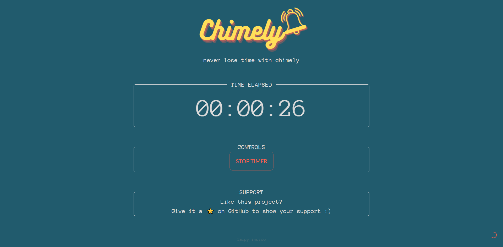

# Chimely: Timely reminders to stay on task

## Project Description:

Introducing a simple, single page __productivity__ web app built with Python and Taipy.

Chimely isn't really about "keeping track of time"... it's more about "__not losing track of time__" (a common pittfall for developers when focused on a task).

  

### The idea
The idea for Chimely stems from a "productivity hack" the author already uses. Basically, you set a timer, time passes, timer alerts, you silence/restart timer. It's a simple idea, 
but quite powerful.  

It can be done with your phone, PC, or even a kitchen timer - but the main trouble is that they require the user to __switch focus__ to stop the alarm and restart it for another period.  

What would be better, is a system that __gently__ reminds you the interval has passed - but NOT require any further action (__distraction__) for ongoing notifications.

### Example
- User sets an interval (eg. 20 minutes) and a timer starts.
- After the interval has elapsed, an audible "chime" (and browser notification) alerts the user that 20 minutes has passed.
- The timer continues in the background until it reaches 40 minutes, at which time it will notify the user __again__.
- This continues until the user stops the timer or closes their browser/tab.

## Tech Stack
This project was built and tested with Python 3.9 and Taipy 3.1.0.

## Get started
1) Clone this repo
2) Create and activate a virtual environment (optional)
3) pip install -r requirements.txt
4) python main.py
5) select an interval (or add custom interval) to start the timer
6) never lose track of time again!
7) star this repo 😉
